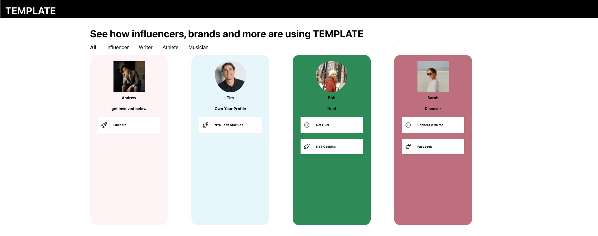
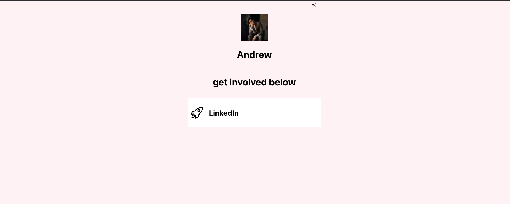

## Discover Page - Profile Cards

This small project was initially for an interview homework assignment to mock their discover page; however, I had a fun time working on it and spent some extra time making additional improvements. I tried to redact any information related to the company and replaced it with `TEMPLATE`, which can easily be replaced.

The project was created with create-react-app, typescript, and styled-components. 

## Project Details

The project is ultimately a user interface that allows you to view and filter based on a person's profession; it is currently setup for "Influencer", "Writer", "Athlete", and "Musician" but can be improved to add more categories dynamically. 

Features:
- User can filter profiles based on category/profession
- User can view an indiviudal profile which contains the user's selected theme, profile links, profile picture, and their bio. 
- Easily integrated with an API that provides the right metadata to support the UI (ex: email, pages, category, etc)

Screenshots below for the two main pages:





## Developer guide

To build and develop the project locally run the following commands:
```
npm install
npm run start 
```

The above commands will install all necessary packages and allow you to run the application in development mode. Open [http://localhost:3000](http://localhost:3000) to view it in the browser. 

## Developer Notes
Right now the project is setup with mock data located in the [test.ts](./mock/test.ts) file. Ideally this would be setup with an API to fetch the profiles with the proper metadata described in the mock file.

